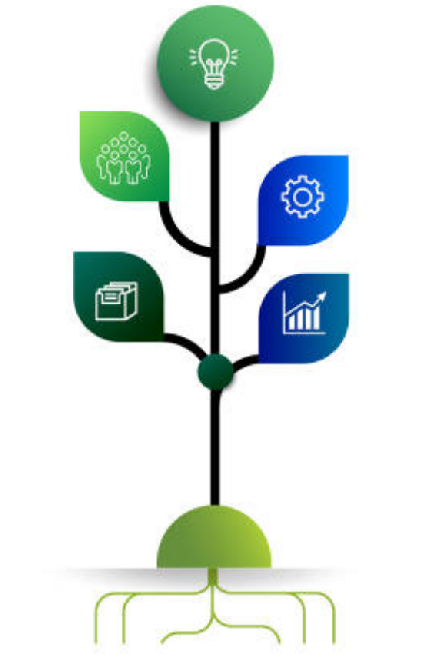

# About
We aim to find practical way of workings, methods and tools to address information management, which is surprisingly difficult.  
About the name 'sykea', which means 'fig tree' in greek. Actually the word should be 'syke' which is the koine version, but, prounounced this is similar to 'psyche' which means mind, and that is not what we mean here. Instead we adhere to the metaphor of a tree with fruits, information with a structure adding value. 

# What it is all about
This is not a place that describes how information management is done, primarily. Instead it is a workshop for finding out, how it is done and mainly, how people can learn to perform it.

# A first shot
Abstract base classes. Från mkt enkla 'informationshantering' eller 'ärende'. 
Manualen. 
Vad är informationsförvaltning. Ngn vill ngt o har eller får information(use case) o ngn gör ngt (feature) o (arch form) o information uppstår, eller förädlas, kan ofta delas med user.
Styrning. Detta är ju ett lager till ovanpå det vi skrivit ovan. Det är det det blir informatoin management  
T.ex semesterbilder. Man har en egen styrning att se till att spara. Man ser till att lägga på metadata om vem som var med osv. utöver timestamp som redan finns. 

# Way of working
Beskriv ett mål. Så här långt är det oklart vad det är men vi definierar det efter hand.  

Vad behöver vi beskriva. Kan göra som Oneliners. Use cases för att exempelifiera
I grunden inte så svårt. D börjar m att ngn vill ngt o den eller ngn annan gör ngt. Då kan värde tillföras på något sätt, dvs saken blir utförd, eller värde tillförs vilket är värdet i sig. Exvis. Ansökan om båtplats. Info behövs för vem, förävntad kötid, båtplats m konrtakt.  

Exvis Ta en bild m mobilkameran. Lägg upp i en molntjänst. Bilden är sparad/backup. Bilden kan delas. Vi kan hitta bilden om ett tag.  
Här ser vi en rad asepkter:
- Ngt händer alltid, det är alltid upprinnelsen. Händelsen är i sig viktig, att den beskrivs, vad hände. Kan samma sak upprepas så vi får same resultat. men även info finns eller uppstår o ffa metainfo uppstår, som 'när togs bilden' eller 'vad beskriver bilden'(tags).
- Vi ser alltså redan här att det finns två grundkomponenter. En aktivitet som har en orsak o syfte o resultat. Information runt denna.
- I verkligehetn är det en rad aspekter osm gör att detta kompliceras o blir svårt.
- Offentlig verksamhet. Lagar o regler styr. Mängden information. Komplexiteten, olika typer av information, olika format, dokument, bilder. Ägarskap, vem äger. Oklara eller ej beskrivna aktiviteter, när uppstår o hur får vi veta vad vi skall göra med. Men detta är bara en aspekt, grunden är den samma.
- Vi behöver därför termer så vi vet vad vi pratar om. Informatonsmängd. Dokument. Informatoinsbärare. Tillgångar.  

Grunden är alltså enkel. Men snabbt behövs ngt annat, ngt som kan hantera komplexitet o här behövs både lagar o regler som vet det juridiska. T.ex vad är ett kontrakt, för en båtplats eller anställning. En faktura. Vad är lagar kring detta. Men det här är inte säkert att vi skall beskriva här. Allt är bara variationer av samma sak. All informationshantering har regler, ibland enkla, som att barnen får inte råka ta bort semesterbilderna. Ibland livsviktiga som spårbarhet vid utveckling av medicintekniska produkte.r . Men vi parkerar det här o håller oss t grunderna.
Same m att förstå när information uppstår, i en aktivitet. Det är arkitektur o tjäntsedesign bra på att beskriva. Så vi går dit o hämtar kunskapen isf att beskriva här.
Information, aktiviteter är svåra att beskriva men här hämtar vi metodiker ifrån arkitektur och tjänstedesign eller ifrån andra kompetenser, som storytelling. Hur mkt vi kommer att beskriva här är dock oklart, bättre att referera till de som beskirver på ett bra sätt o då muda/waste att bara repetera här.  
Det viktiga är att få på plats en verkstad, en designsituation för att ta fram sätt som fungerar praktiskt för läsare. 
