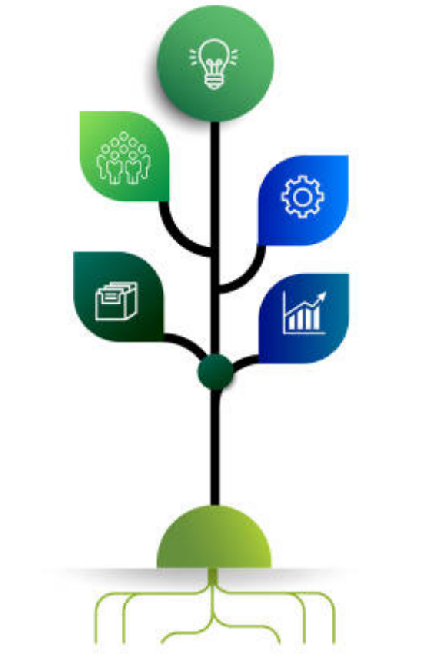

# About
We aim to find practical way of workings, methods and tools to address information management, which is surprisingly difficult.  
About the name 'sykea', which means 'fig tree' in greek. Actually the word should be 'syke' which is the koine version, but, prounounced this is similar to 'psyche' which means mind, and that is not what we mean here. Instead we adhere to the metaphor of a tree with fruits, information with a structure adding value. 

# What it is all about
This is not a place that describes how information management is done, primarily. Instead it is a workshop for finding out, how it is done and mainly, how people can learn to perform it.

# A first shot
Abstract base classes. Från mkt enkla 'informationshantering' eller 'ärende'. 
Manualen. 
Vad är informationsförvaltning. Ngn vill ngt o har eller får information(use case) o ngn gör ngt (feature) o (arch form) o information uppstår, eller förädlas, kan ofta delas med user.
Styrning. Detta är ju ett lager till ovanpå det vi skrivit ovan. Det är det det blir informatoin management  
T.ex semesterbilder. Man har en egen styrning att se till att spara. Man ser till att lägga på metadata om vem som var med osv. utöver timestamp som redan finns. 

# Way of working
Beskriv ett mål. Så här långt är det oklart vad det är men vi definierar det efter hand.  

Vad behöver vi beskriva. Kan göra som Oneliners. Use cases för att exempelifiera
I grunden inte så svårt. D börjar m att ngn vill ngt o den eller ngn annan gör ngt. Då kan värde tillföras på något sätt, dvs saken blir utförd, eller värde tillförs vilket är värdet i sig. Exvis. Ansökan om båtplats. Info behövs för vem, förävntad kötid, båtplats m konrtakt.  

Exvis Ta en bild m mobilkameran. Lägg upp i en molntjänst. Bilden är sparad/backup. Bilden kan delas. Vi kan hitta bilden om ett tag.  
Här ser vi en rad asepkter:
- Ngt händer alltid, det är alltid upprinnelsen. Händelsen är i sig viktig, att den beskrivs, vad hände. Kan samma sak upprepas så vi får same resultat. men även info finns eller uppstår o ffa metainfo uppstår, som 'när togs bilden' eller 'vad beskriver bilden'(tags).
- Vi ser alltså redan här att det finns två grundkomponenter. En aktivitet som har en orsak o syfte o resultat. Information runt denna.
- I verkligehetn är det en rad aspekter osm gör att detta kompliceras o blir svårt.
- Offentlig verksamhet. Lagar o regler styr. Mängden information. Komplexiteten, olika typer av information, olika format, dokument, bilder. Ägarskap, vem äger. Oklara eller ej beskrivna aktiviteter, när uppstår o hur får vi veta vad vi skall göra med. Men detta är bara en aspekt, grunden är den samma.
- Vi behöver därför termer så vi vet vad vi pratar om. Informatonsmängd. Dokument. Informatoinsbärare. Tillgångar.  

Grunden är alltså enkel. Men snabbt behövs ngt annat, ngt som kan hantera komplexitet o här behövs både lagar o regler som vet det juridiska. T.ex vad är ett kontrakt, för en båtplats eller anställning. En faktura. Vad är lagar kring detta. Men det här är inte säkert att vi skall beskriva här. Allt är bara variationer av samma sak. All informationshantering har regler, ibland enkla, som att barnen får inte råka ta bort semesterbilderna. Ibland livsviktiga som spårbarhet vid utveckling av medicintekniska produkte.r . Men vi parkerar det här o håller oss t grunderna.
Same m att förstå när information uppstår, i en aktivitet. Det är arkitektur o tjäntsedesign bra på att beskriva. Så vi går dit o hämtar kunskapen isf att beskriva här.
Information, aktiviteter är svåra att beskriva men här hämtar vi metodiker ifrån arkitektur och tjänstedesign eller ifrån andra kompetenser, som storytelling. Hur mkt vi kommer att beskriva här är dock oklart, bättre att referera till de som beskirver på ett bra sätt o då muda/waste att bara repetera här.  
Det viktiga är att få på plats en verkstad, en designsituation för att ta fram sätt som fungerar praktiskt för läsare. 

# Så
Vi tror inte det är att den bästa vägen är en ide, eller en lösning/produkt eller ett mål utan istället att skapa en verkstad för gemensamt lärande genom praktiskt experiment. 

# Pigaller
## First draft
I Det finns soo many different attempts praktiskt kring dokumenthanteringssystem. det finns så mkt skrivet, inte minst sammanfattat på www.informationsforvaltning.com. Ändå är det så svårt att få till.  
Det kan bero på att det är ett komplext problem. Det måste isåfall utforskas. Kan det vara så att användande skall vara där man börjar, eftersom mkt av det som gjorts är på olika sätt styurande. Kan man istället utgå från observationer, insights, habituations. T.ex att egna, personliga kataloger med arbetsmaterial, olika projekt där man är med osv. snabbt blir svåröverskådliga, man tappar bort sig, glömmer var man lagt saker eller var man var.
II Skulle ett tänkande enligt 'Design Things' kunna vara ett experiment att på något sätt prova för erfarenheter om det finns ideer där som fungerar. Att man inte börjar med ordning o reda, versionshantering osv. utan tvärtom, utifrån vad som är naturligt, hur man behövver komma åt, dela med sig själv o nadra via en molntjänst, hitta lagringsytor som är enkla att redigera i, utifrån den form man behöver, text eller bilder/modeller. 
III Hur skulle man kunna börja prova detta? Det viktiga är att det blir praktiskt, inte yet another specification. What would git do, är en annan approachering.

## Om information
I Information är svår att greppa och innan vi gör det behöver vi förmodligen först en bättre förståelse för. 
Det finns data, sedan information, kunskap, det är en indelning. Sedan finns aspekter om, en slags metainformation, varför, av vem, när har informationen kommit till. Sedan format, vad är det för något, i vilken form ser vi den nu eller är den tänkt. Men det ifnns även andra lager, som 'meningsbyggande', att den är till för något och vad är detta. Sedna även 'meningsskapande' att den alltså är på ett sätt rörlig, flyktig, den kan ha olika egenskaper för olika sammanhang. Ett annat sätt att tänka är i 'outcome'(vad en verksamhet vill) och 'impact'(vad en användare vill). Den kan sedan ha state, att den är utkast, under arbete, granskning eller godkänd t.ex. Det här gäller alla typer, data, information, mening men är förmodligen enklare att greppa för ren data, t.ex något har samlats in, vid en tidpunkt, för ett syfte, än en komplicerad text där det inte finns en enkel tolkning utan det beror på vem som läser, när, t.ex litteratur eller musik. Det kan också vara normativ eller deskriptiv, information och ibland förväxlas detta, någon säger något som andra tar som en uppmaning eller regel.

II Om vi dels ser metainformation som sätt att klassificera, underlätta tt hantera och förstå information så kan förmodligen även detta med att leta upp, hitta eller för den som skapar informationen, enklare veta var den skall läggas, hur andra skall hitta osv. 
En ansats är att systemutveckling, objektorientering, arkitektur och enterprise design har något att bidra med här eftersom dessa alla hela tiden hanterar information och är vana vid komplexa samband och komplexa nivåer av betydelse. Ett antagande är också att informationsförvaltning av mera organiserande, styrande typ är sämre på detta och mer rör sig i det kompnlicerade planet, kring att kategorisera, tidsstämpla, ordna, sätta enklare etiketter på. Ett antagande är att detta är en orsak till att informationsförvlatning är svår att fås att fungera på ett bra sätt. 

III <optics> Man ser direkt att II inte validerar I. Det ifnns inget direkt färdigt förslag att varken analysera eller build/experience i II och I är spretigt, ej heltäckande, o-formulerat, o-förstått.
X
L Det är ändå en början

## Om angränsande sätt kring information från litteratur, drama
I En insikt är att om man vänder på det så hanterar litteratur och drama egentligen information, i olika nivåer av betydelsebärande, betydelseskapande och behöver hantera sätt att få den begriplig för en publik, t.ex ett svårt eller mångbottnat stycke dramatik som på olika sätt behöver gestaltas för att en publik skall kunna ta det till sig på ett meningsfullt sätt. Ett antagande är då att även när det gäller 'verksamhetsinformation', eller professionell informatoin s.as. så kanske detta kan vara ett sätt att både hantera, för de som skapar och för de som använder informationen.
II Man skulle kunna hämta inspiration från dramatiken, scenkonsten, hur komplicerade begrepp eller meningar i en text(information) görs påtaglig och begriplig.
III tbd
X, L tbd

